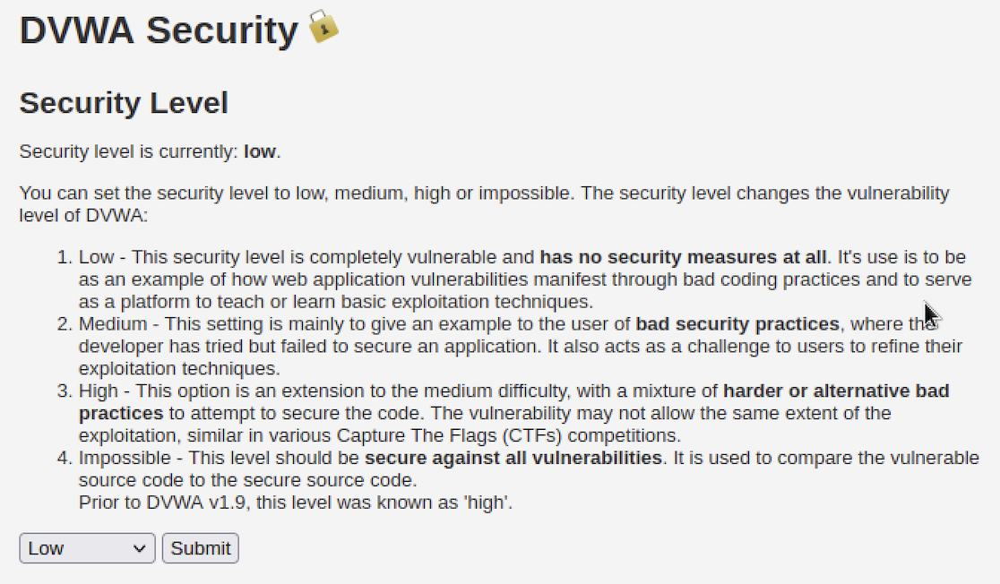
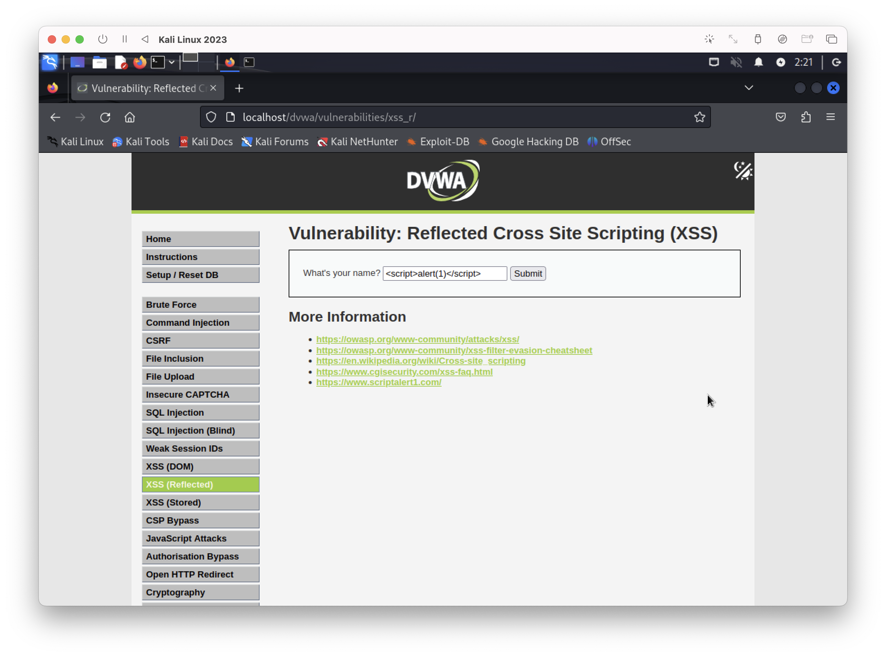
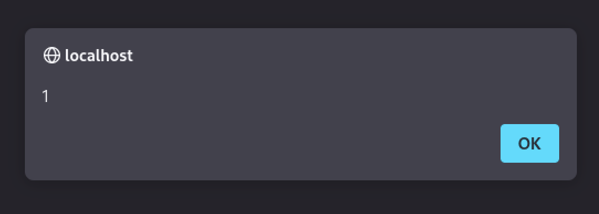
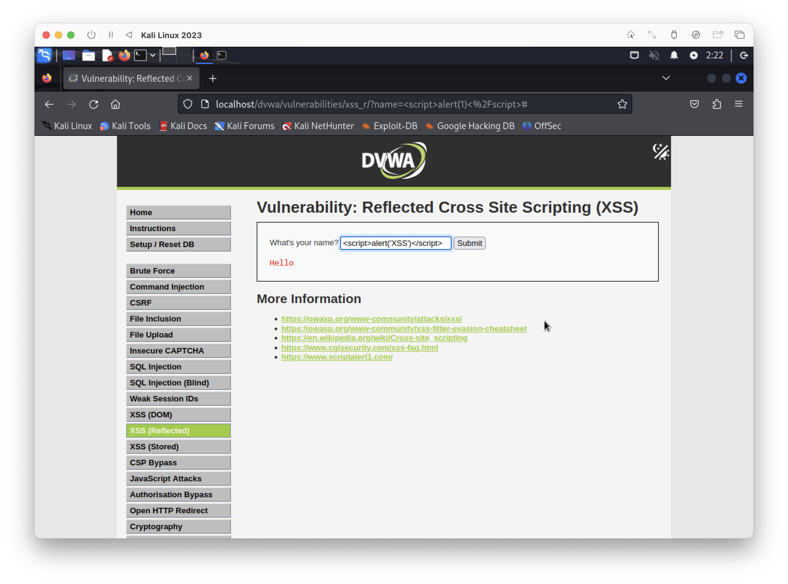
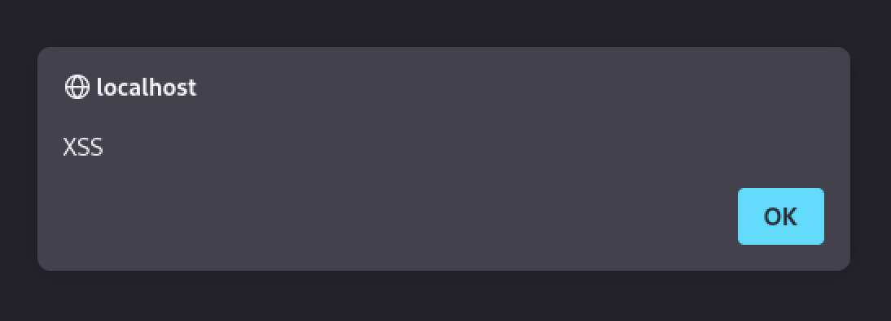
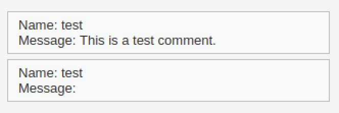
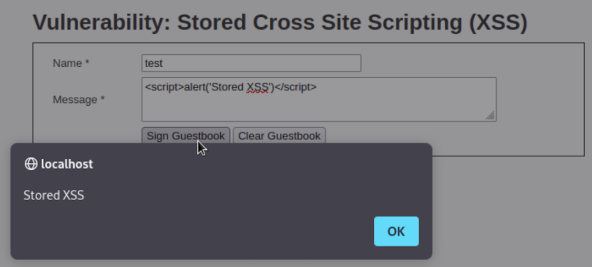

# DVWA Web Vulnerability Lab
DVWA 환경에서 주요 웹 취약점(SQL Injection, XSS 등)을 직접 실습하고 정리한 보안 실습 포트폴리오입니다.

## 1. 실습 환경 (Environment)
- OS: Kali Linux (VM)
- Web Server: Apache2
- Database: MariaDB
- Target Application: DVWA (Damn Vulnerable Web Application)

## 2. SQL Injection Practice (DVWA)
SQL Injection 취약점 실습 및 인증 우회 공격 테스트

### 2-1. 실습 목적 (Purpose)
SQL Injection을 이론으로만 학습하는 것이 아니라,
취약한 쿼리 구조에서 사용자 입력값이 어떻게 해석되는지 직접 확인하고,
인증 우회 및 데이터베이스 정보 노출이 실제로 발생하는 과정을 검증하기 위해 실습하였다.
이를 통해 안전하지 않은 쿼리 작성 방식의 위험성을 명확히 이해하는 것을 목표로 한다.

### 2-2. 실습 과정 (Practice Process)
- 보안 레벨: Low (DVWA Security Level)

#### (1) DVWA 접속
- URL: http://localhost/dvwa
- 기본 계정으로 로그인

#### (2) 취약점 메뉴 이동
- Vulnerabilities → SQL Injection

#### (3) 페이로드 입력
' OR '1'='1

### 2-3. 실습 결과 (Result)

#### (1) 기본 ID 조회 테스트
    1

설명:
ID 값에 1을 입력하면 해당 ID의 사용자 정보가 정상적으로 조회된다.

#### (2) 인증 우회 공격 (OR 1=1)
    ' OR '1'='1

설명:
조건이 항상 참이 되면서 모든 사용자 정보가 한 번에 출력된다.
→ 인증 우회가 제대로 되는 것을 확인하였다.

원인:
입력값이 쿼리에 직접 삽입되는 구조로, 사용자 입력에 대한 검증 및 이스케이프 처리가 전혀 이루어지지 않아 논리 조작이 가능했다.

#### (3) DB 정보 추출 (UNION SELECT)
    ' UNION SELECT user(), database() #

설명:
UNION SELECT로 현재 DB 사용자랑 데이터베이스 이름까지 바로 노출된다.
→ 입력값 검증을 안 하면 진짜 위험하다는 것을 체감할 수 있었다.

### 2-4. 정리 (Summary)
이번 실습을 통해 SQL Injection은 단순한 이론적 취약점이 아니라,
실제 서비스 환경에서도 인증 우회, 데이터 유출, 계정 탈취 등
심각한 보안 사고로 직결될 수 있는 고위험 취약점임을 확인하였다.

특히 입력값 검증이 없는 경우 공격 난이도가 매우 낮아,
자동화 도구를 통한 대량 공격도 가능하다는 점에서 위험성이 크다.

### 2-5. 대응 방안 (Mitigation)
이러한 SQL Injection 취약점을 방지하기 위해서는 다음과 같은 보안 조치가 필요하다.

- Prepared Statement(Parameterized Query) 사용으로 쿼리 구조와 데이터를 분리
- 사용자 입력값에 대한 서버단 검증 및 화이트리스트 기반 필터링
- DB 계정에 최소 권한 원칙 적용 (SELECT, INSERT 등 필요한 권한만 부여)
- 에러 메시지 노출 제한으로 내부 쿼리 구조 은폐

이를 통해 쿼리 조작 및 정보 노출 위험을 효과적으로 줄일 수 있다.

## 3. XSS (Cross-Site Scripting) 실습

### 3-1. 실습 목적 (Purpose)
XSS 취약점을 이론으로만 이해하는 것이 아니라,
사용자 입력값이 필터링 없이 화면에 출력될 경우
스크립트가 실제로 실행되는 과정을 직접 확인하고,
Reflected XSS와 Stored XSS의 동작 차이와 위험성을 비교 분석하기 위해 실습하였다.

### 3-2. 실습 과정 (Practice Process)

#### (1) Reflected XSS 입력 위치 확인
- 메뉴: Vulnerabilities → XSS (Reflected)
- 입력창: What's your name?

#### (2) 입력값 반영 여부 확인 테스트
- 테스트 입력:
  1
- Submit 버튼 클릭
→ 입력한 값이 화면에 그대로 출력되는지 확인

#### (3) Reflected XSS 스크립트 입력
- 테스트 페이로드:
  
- Submit 버튼 클릭
→ alert 팝업이 발생하는지 확인

#### (4) Stored XSS 입력 위치 이동
- 메뉴: Vulnerabilities → XSS (Stored)
- 입력창: Guestbook comment

#### (5) Stored XSS 스크립트 입력
- 테스트 페이로드:
  
- Sign Guestbook 클릭
→ 페이지 새로고침 시 자동 실행되는지 확인

### 3-3. 실습 결과 (Result)

#### (1) 입력값 반영 확인 테스트

설명:  
입력한 값이 필터링 없이 그대로 화면에 출력되는 것을 확인하였다.  
→ 사용자 입력값이 서버에서 검증 없이 그대로 응답에 반영되는 구조임을 확인하였다.  
→ XSS 공격이 가능한 기본 조건이 충족됨을 의미한다.

#### (2) Reflected XSS 스크립트 실행 결과

  

설명:  
입력한 스크립트가 서버에서 필터링되지 않고 그대로 응답에 포함되어 실행되었다.  
→ Reflected XSS 취약점이 존재함을 확인하였다.

#### (3) Stored XSS 결과

  

설명:  
악성 스크립트가 DB에 저장되고,  
다른 사용자가 페이지에 접속할 때마다 자동으로 실행된다.  
Stored XSS는 지속성이 있어 Reflected XSS보다 더 위험하다.
→ Stored XSS는 세션 탈취, 피싱 페이지 삽입, 악성 스크립트 배포 등
2차 피해로 확장될 수 있어 매우 치명적인 취약점이다.

### 3-4. 정리 (Summary)
이번 실습을 통해 XSS는 단순히 alert 창이 뜨는 문제가 아니라,
사용자 입력값이 검증 없이 화면에 출력될 경우
임의의 스크립트가 실행되어 세션 탈취, 계정 탈취, 악성 페이지 삽입 등
심각한 보안 사고로 이어질 수 있는 고위험 취약점임을 확인하였다.

특히 Reflected XSS는 즉시 실행되며,
Stored XSS는 DB에 저장되어 모든 사용자에게 반복 실행된다는 점에서
Stored XSS의 위험성이 더 크다는 것을 체감할 수 있었다.

### 3-5. 대응 방안 (Mitigation)
XSS 취약점을 방지하기 위해서는 다음과 같은 보안 조치가 필요하다.

- 사용자 입력값에 대한 HTML 엔티티 인코딩 처리 (escape)
  → `<`, `>`, `"`, `'` 등을 HTML 코드로 변환하여 스크립트 실행 차단
- 출력 시점에서의 필터링(Output Encoding) 적용
- 입력값 검증(Validation)**을 통한 스크립트, 태그 입력 차단
- Content Security Policy(CSP) 적용으로 스크립트 실행 제한
- 신뢰되지 않은 데이터는 innerHTML 사용 금지, textContent 사용

이를 통해 스크립트 삽입 및 실행을 원천적으로 차단할 수 있다.
