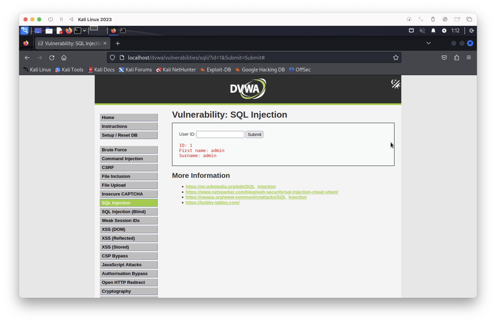
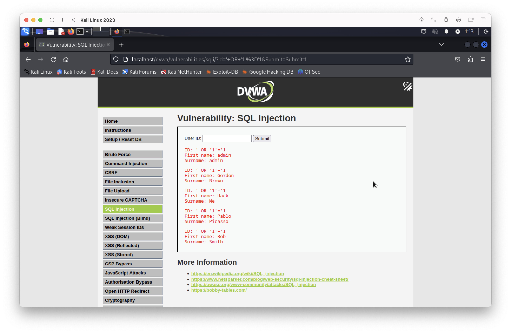
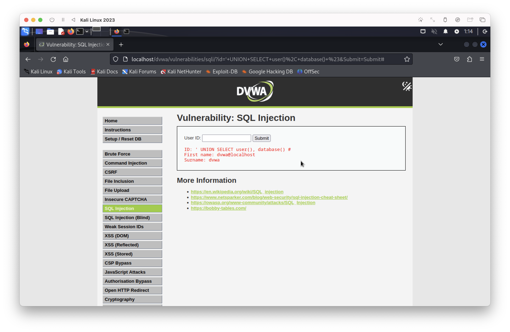

# SQL Injection Practice (DVWA)
SQL Injection 취약점 실습 및 인증 우회 공격 테스트

## 1. 실습 환경 (Environment)
- OS: Kali Linux (VM)
- Web Server: Apache2
- Database: MariaDB
- Target Application: DVWA (Damn Vulnerable Web Application)

## 2. 실습 목적 (Purpose)
SQL Injection을 이론으로만 배우는 게 아니라,
실제 환경에서 직접 입력해보면서 인증 우회와 DB 정보 노출이 어떻게 발생하는지 확인하고,
입력값 검증이 제대로 되지 않았을 때 어떤 문제가 생기는지 체감하기 위해 실습하였다.

## 3. 실습 과정 (Practice Process)

### (1) DVWA 접속
- URL: http://localhost/dvwa
- 기본 계정으로 로그인

### (2) 취약점 메뉴 이동
- Vulnerabilities → SQL Injection

### (3) 페이로드 입력
' OR '1'='1

## 4. 실습 결과 (Result)

### 4-1. 기본 ID 조회 테스트
    1

설명:
ID 값에 1을 입력하면 해당 ID의 사용자 정보가 정상적으로 조회된다.

### 4-2. 인증 우회 공격 (OR 1=1)
    ' OR '1'='1

설명:
조건이 항상 참이 되면서 모든 사용자 정보가 한 번에 출력된다.
→ 인증 우회가 제대로 되는 것을 확인하였다.

### 4-3. DB 정보 추출 (UNION SELECT)
    ' UNION SELECT user(), database() #

설명:
UNION SELECT로 현재 DB 사용자랑 데이터베이스 이름까지 바로 노출된다.
→ 입력값 검증을 안 하면 진짜 위험하다는 것을 체감할 수 있었다.

## 5. 정리 (Summary)
이번 실습으로 SQL Injection이 단순 이론 문제가 아니라,
입력값 검증이 제대로 이루어지지 않을 경우 
공격자가 인증 우회 및 데이터베이스 정보 탈취가 가능함을 직접 확인할 수 있었다.
